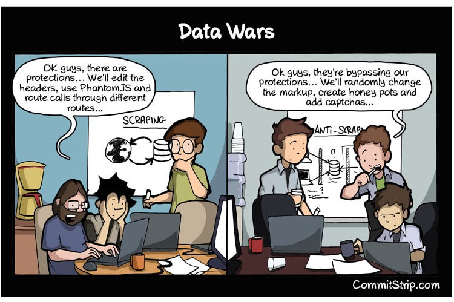

# Web Scraping With Google Sheets - Module 3 | ETA: 1 hour

Web scraping and utilizing various APIs are great ways to collect data from websites and applications that can later be used in data analytics. Some companies have their entire business model focused on web scraping. HiQ crawls various “Public” websites to collect data and provide analytics for companies on their employees. They help companies find top talent using sites data like Linkedin, and other public sources to gain the information needed in their algorithms.

However, they ran into legal issues when Linkedin asked them to cease and desist as well as put in certain technical methods to slow down HiQ’s web crawlers. [HiQ subsequently sued Linkedin and won!](https://www.theregister.co.uk/2017/08/14/hiq_linkedin_bots_scraping/) The judge said as long as the data was public, it was ok to scrape!

Web scraping typically requires a complex understanding of HTTP requests, faking headers, complex Regex statements, HTML parsers, and database management skills.

There are programming languages that make this much easier such as Python. Python offers libraries like Scrapy and BeautifulSoup that make scraping and parsing HTML easier.

However, it still requires proper design, a decent understanding of programming and website architecture.

Google sheets offer several useful functions that can help scrape web data for those who don’t have the time to learn programming. If you would like to see the video of our webinar it is below. If not, you can continue to read and figure out how to use Google Sheets to scrape websites.

## Google Sheet Functions For Web Scraping

**The functions you can use for web scraping with google sheets are:**

- ImportXML
- ImportHTML
- ImportFEED
- ImportDATA

All of these functions will scrape websites based off of different parameters provided to the function. 

**Web Scraping With ImportFeed**

The ImportFeed Google Sheet function is one of the easier functions to use. It only requires access to Google Sheets and a URL for a rss feed. This is a feed that is typically associated with a blog.

For instance, you could use the RSS feed listed below. “http://www.acheronanalytics.com/2/feed".

How do you use this function? An example is given below.

“=ImportFeed( “http://www.acheronanalytics.com/2/feed")

That is all that is needed! There are some other tips and tricks that can help clean up the data feed as you will get more than just one column of information. For now, this is a great start at web scraping.

**Do The Google Sheet Import Functions Update?**

All of these import function automatically update data every 2 hours. A trigger function can be set to increase the cadence of updates. However this requires more programming.

This is it in this case! From here, it is all about how your team uses it! Make sure you engineer a solid data scraping system.

The picture above is an example of of using the ImportFeed function.

**Web Scraping With ImportXML**

The ImportXML function in Google Sheets is used to pull out specific data points using HTML ids, and classes. This requires some understanding of HTML and parsing XML. This can be a little frustrating. So we created a step by step for web scraping for HTML.

Here are some examples from an EventBrite page.

1. Go to https://www.eventbrite.com/d/wa--everett/events/
2. Right Click Inspect Element
3. Find the HTML tag you are interested in
4. We are looking for 
 Some Text Here

5. So this is the tricky part. The first part you need to pull out from this HTML tag is the type. This would be like 
, <a>, , , etc. This first one can be called out using “//” then the tag name. Such as “//div”, “//a” or “//span”.
6. Now, if you actually want to get the “Some Text Here” you will need to call out the class.
7. That is done in the method shown in step 5. You will notice it combines using “//div” with the “[@class=”class name here”].
8. The xml string is “//**div[@class=’list-card__body’]**”
9. There is another data value you might want to get.
10. We want to get all the URLs
11. This case would involve wanting to pull out the specific value inside of the first HTML tag itself. For instance, <a href=”https//www.google.com">Click here</a>.
12. Then it would be like step 7.
13. The xml string is “//a/@href”
14. ImportXML(URL, XML String)
15. ImportXML(“https://www.eventbrite.com/d/wa--everett/events/",“//**div[@class=’list-card__body’]**”)

The truth about using this function is that it requires a lot of time. Thus, it requires planning and designing a good google sheet to ensure you get the maximum benefit from utilizing. Otherwise, your team will end up spending time maintaining it, rather than working on new things. Like in the picture below

From xkcd

**Web scraping With ImportHTML**

Finally, we will discuss ImportHTML. This will import a table or list from a web page. For instance, what if you want to scrape data from a site that contains stock prices like [https://coinmarketcap.com/](https://coinmarketcap.com/). There is a table on this page that has the stock prices from the past few days.

Similar to the past functions you need to use the URL. On top of the URL, you will have to mention which table on the webpage you want to grab. You can do this by utilizing the which number it might be.

An example would be ImportHTML(“https://coinmarketcap.com/", "table", 1). This will scrape the stock prices from the link above.

