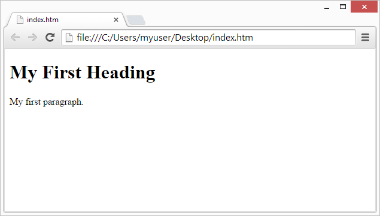

<html><head><meta content="text/html; charset=UTF-8" http-equiv="content-type"></head><body class="c6"><h2 class="c0" id="h.gjdgxs">What is HTML?</h2>
HTML is the standard markup language for creating Web pages.
<ul class="c19 lst-kix_list_1-0 start"><li class="c26">HTML stands for Hyper Text Markup Language</li><li class="c7">HTML describes the structure of Web pages using markup</li><li class="c7">HTML elements are the building blocks of HTML pages</li><li class="c7">HTML elements are represented by tags</li><li class="c7">HTML tags label pieces of content such as &quot;heading&quot;, &quot;paragraph&quot;, &quot;table&quot;, and so on</li><li class="c5">Browsers do not display the HTML tags, but use them to render the content of the page</li></ul>

<h2 class="c0" id="h.30j0zll">A Simple HTML Document</h2><h3 class="c29" id="h.1fob9te">Example</h3>
&lt;!DOCTYPE&nbsp;html&gt;

&lt;html&gt;

&lt;head&gt;

&lt;title&gt;Page Title&lt;/title&gt;

&lt;/head&gt;

&lt;body&gt;

&lt;h1&gt;My First Heading&lt;/h1&gt;

&lt;p&gt;My first paragraph.&lt;/p&gt;

&lt;/body&gt;

&lt;/html&gt;
<h3 class="c0" id="h.3znysh7">Example Explained</h3><ul class="c19 lst-kix_list_2-0 start"><li class="c26">The &lt;!DOCTYPE html&gt;&nbsp;declaration defines this document to be HTML5</li><li class="c7">The &lt;html&gt;&nbsp;element is the root element of an HTML page</li><li class="c7">The &lt;head&gt;&nbsp;element contains meta information about the document</li><li class="c7">The &lt;title&gt;&nbsp;element specifies a title for the document</li><li class="c7">The &lt;body&gt;&nbsp;element contains the visible page content</li><li class="c7">The &lt;h1&gt;&nbsp;element defines a large heading</li><li class="c5">The &lt;p&gt;&nbsp;element defines a paragraph</li></ul>

<h2 class="c0" id="h.2et92p0">HTML Tags</h2>
HTML tags are element names surrounded by angle brackets:

&lt;tagname&gt;content goes here...&lt;/tagname&gt;
<ul class="c19 lst-kix_list_3-0 start"><li class="c26">HTML tags normally come in pairs&nbsp;like &lt;p&gt;&nbsp;and &lt;/p&gt;</li><li class="c7">The first tag in a pair is the start tag,&nbsp;the second tag is the end tag</li><li class="c5">The end tag is written like the start tag, but with a forward slash&nbsp;inserted before the tag name</li></ul>
Tip:&nbsp;The start tag is also called the opening tag, and the end tag the closing tag.

<h2 class="c0" id="h.tyjcwt">Web Browsers</h2>
The purpose of a web browser (Chrome, IE, Firefox, Safari) is to read HTML documents and display them.

The browser does not display the HTML tags, but uses them to determine how to display the document:

<h2 class="c0" id="h.3dy6vkm">HTML Page Structure</h2>
Below is a visualization of an HTML page structure:

&lt;html&gt;

&lt;head&gt;

&lt;title&gt;Page title&lt;/title&gt;

&lt;/head&gt;

&lt;body&gt;

&lt;h1&gt;This is a heading&lt;/h1&gt;

&lt;p&gt;This is a paragraph.&lt;/p&gt;

&lt;p&gt;This is another paragraph.&lt;/p&gt;

&lt;/body&gt;

&lt;/html&gt;

Note:&nbsp;Only the content inside the &lt;body&gt; section (the white area above) is displayed in a browser.

<h2 class="c0" id="h.1t3h5sf">The &lt;!DOCTYPE&gt; Declaration</h2>
The &lt;!DOCTYPE&gt;&nbsp;declaration represents the document type, and helps browsers to display web pages correctly.

It must only appear once, at the top of the page (before any HTML tags).

The &lt;!DOCTYPE&gt;&nbsp;declaration is not case sensitive.

The &lt;!DOCTYPE&gt;&nbsp;declaration for HTML5 is:

&lt;!DOCTYPE&nbsp;html&gt;

<h2 class="c0" id="h.4d34og8">HTML Versions</h2>
Since the early days of the web, there have been many versions of HTML:
<table class="c30"><tbody><tr class="c20"><td class="c18" colspan="1" rowspan="1">
Version
</td><td class="c27" colspan="1" rowspan="1">
Year
</td></tr><tr class="c20"><td class="c18" colspan="1" rowspan="1">
HTML
</td><td class="c27" colspan="1" rowspan="1">
1991
</td></tr><tr class="c20"><td class="c18" colspan="1" rowspan="1">
HTML 2.0
</td><td class="c27" colspan="1" rowspan="1">
1995
</td></tr><tr class="c20"><td class="c18" colspan="1" rowspan="1">
HTML 3.2
</td><td class="c27" colspan="1" rowspan="1">
1997
</td></tr><tr class="c20"><td class="c18" colspan="1" rowspan="1">
HTML 4.01
</td><td class="c27" colspan="1" rowspan="1">
1999
</td></tr><tr class="c20"><td class="c18" colspan="1" rowspan="1">
XHTML
</td><td class="c27" colspan="1" rowspan="1">
2000
</td></tr><tr class="c20"><td class="c18" colspan="1" rowspan="1">
HTML5
</td><td class="c27" colspan="1" rowspan="1">
2014
</td></tr></tbody></table>

</body></html>