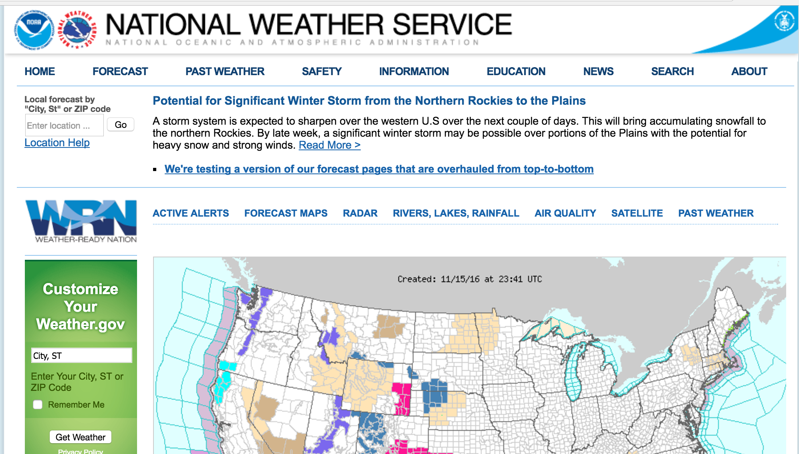
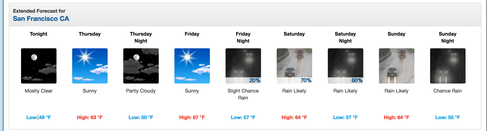
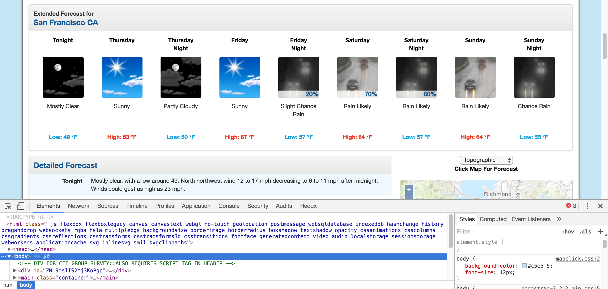
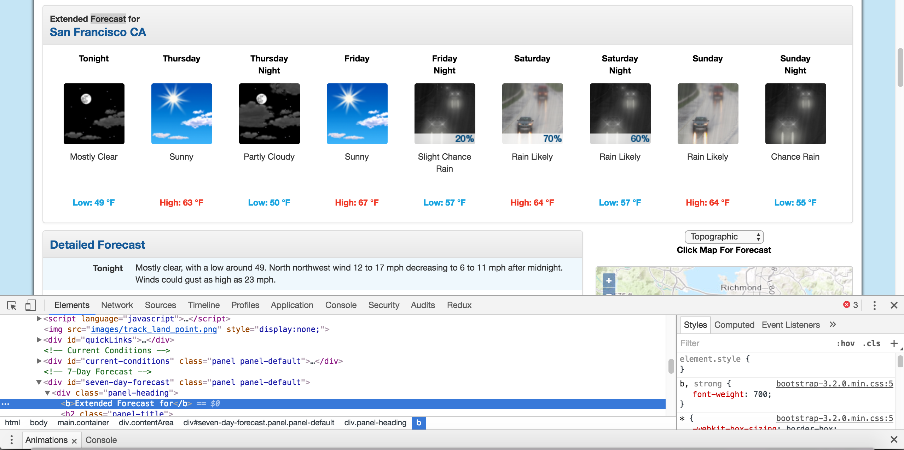
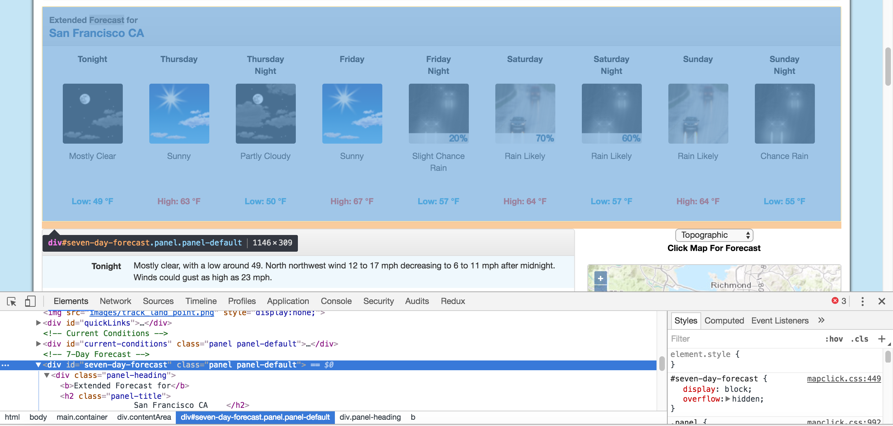

# Python Web Scraping Using BeautifulSoup - MODULE 6 | ETA: 1 HOUR

When performing data science tasks, it’s common to want to use data found on the internet. You’ll usually be able to access this data in csv format, or via an Application Programming Interface (API). However, there are times when the data you want can only be accessed as part of a web page. In cases like this, you’ll want to use a technique called web scraping to get the data from the web page into a format you can work with in your analysis.

In this tutorial, we’ll show you how to perform web scraping using Python 3 and the BeautifulSoup library. We’ll be scraping weather forecasts from the National Weather Service, and then analyzing them using the Pandas library.



We’ll be scraping weather forecasts from the National Weather Service site.

Before we get started, if you’re looking for more background on APIs or the csv format, you might want to check out our Dataquest courses on APIs or data analysis.

## The components of a web page

When we visit a web page, our web browser makes a request to a web server. This request is called a GET request, since we’re getting files from the server. The server then sends back files that tell our browser how to render the page for us. The files fall into a few main types:

- HTML — contain the main content of the page.
- CSS — add styling to make the page look nicer.
- JS — Javascript files add interactivity to web pages.
- Images — image formats, such as JPG and PNG allow web pages to show pictures.

After our browser receives all the files, it renders the page and displays it to us. There’s a lot that happens behind the scenes to render a page nicely, but we don’t need to worry about most of it when we’re web scraping. When we perform web scraping, we’re interested in the main content of the web page, so we look at the HTML.

## The requests library

The first thing we’ll need to do to scrape a web page is to download the page. We can download pages using the Python requests library. The requests library will make a GET request to a web server, which will download the HTML contents of a given web page for us. There are several different types of requests we can make using requests, of which GET is just one. If you want to learn more, check out our API tutorial.

Let’s try downloading a simple sample website, http://dataquestio.github.io/web-scraping-pages/simple.html. We’ll need to first download it using the requests.get method.

```python
import requests
page = requests.get("http://dataquestio.github.io/web-scraping-pages/simple.html")
print(page)
```

```
<Response [200]>
```

After running our request, we get a Response object. This object has a status_code property, which indicates if the page was downloaded successfully:

```python
page.status_code

200
```

A status_code of 200 means that the page downloaded successfully. We won’t fully dive into status codes here, but a status code starting with a 2 generally indicates success, and a code starting with a 4 or a 5 indicates an error.

We can print out the HTML content of the page using the content property:

```python
page.content
```

```python
b'<!DOCTYPE html>\n
<html>\n
<head>\n
<title>A simple example page</title>\n
</head>\n
<body>\n
<p>Here is some simple content for this
page.</p>\n
</body>\n
</html>'
```

## Parsing a page with BeautifulSoup

As you can see above, we now have downloaded an HTML document.

We can use the BeautifulSoup library to parse this document, and extract the text from the p tag. We first have to import the library, and create an instance of the BeautifulSoup class to parse our document:

```python
from bs4
import BeautifulSoup
soup = BeautifulSoup(page.content, 'html.parser')
```

We can now print out the HTML content of the page, formatted nicely, using the prettify method on the BeautifulSoup object:

```python
print(soup.prettify())
```
```html
<!DOCTYPE html>
<html>
<head>
<title>
A simple example page
</title>
</head>
<body>
<p>
Here is some simple content for this page.
</p>
</body>
</html>
```

As all the tags are nested, we can move through the structure one level at a time. We can first select all the elements at the top level of the page using the children property of soup. Note that children returns a list generator, so we need to call the list function on it:

```python
list(soup.children)

['html', '\n', <html> <head> <title>A simple example page</title> </head> <body> <p>Here is some simple content for this page.</p> </body> </html>]
```

The above tells us that there are two tags at the top level of the page — the initial <!DOCTYPE html> tag, and the <html> tag. There is a newline character (\n) in the list as well. Let’s see what the type of each element in the list is:

```python
[type(item) for item in list(soup.children)]

[bs4.element.Doctype, bs4.element.NavigableString, bs4.element.Tag]
```

As you can see, all of the items are BeautifulSoup objects. The first is a Doctype object, which contains information about the type of the document. The second is a NavigableString, which represents text found in the HTML document. The final item is a Tag object, which contains other nested tags. The most important object type, and the one we’ll deal with most often, is the Tag object.

The Tag object allows us to navigate through an HTML document, and extract other tags and text. You can learn more about the various BeautifulSoup objects here.

We can now select the html tag and its children by taking the third item in the list:

```python
html = list(soup.children)[2]
```

Each item in the list returned by the children property is also a BeautifulSoup object, so we can also call the children method on html.

Now, we can find the children inside the html tag:

```python
list(html.children)

['\n', <head> <title>A simple example page</title> </head>, '\n', <body> <p>Here is some simple content for this page.</p> </body>, '\n']
```

As you can see above, there are two tags here, head, and body. We want to extract the text inside the p tag, so we’ll dive into the body:

```python
body = list(html.children)[3]
```

Now, we can get the p tag by finding the children of the body tag:

```python
list(body.children)

['\n', <p>Here is some simple content for this page.</p>, '\n']
```
We can now isolate the p tag:

```python
p = list(body.children)[1]
```
Once we’ve isolated the tag, we can use the get_text method to extract all of the text inside the tag:

```python
p.get_text()

'Here is some simple content for this page.'
```

## Finding all instances of a tag at once

What we did above was useful for figuring out how to navigate a page, but it took a lot of commands to do something fairly simple. If we want to extract a single tag, we can instead use the ***find_all*** method, which will find all the instances of a tag on a page.

```python
soup = BeautifulSoup(page.content, 'html.parser')
soup.find_all('p')

[<p>Here is some simple content for this page.</p>]
```

Note that find_all returns a list, so we’ll have to loop through, or use list indexing, it to extract text:

```python
soup.find_all('p')[0].get_text()

'Here is some simple content for this page.'
```

If you instead only want to find the first instance of a tag, you can use the find method, which will return a single BeautifulSoup object:

```python
soup.find('p')
```

```html
<p>Here is some simple content for this page.</p>
```

## Searching for tags by class and id

We introduced classes and ids earlier, but it probably wasn’t clear why they were useful. Classes and ids are used by CSS to determine which HTML elements to apply certain styles to. We can also use them when scraping to specify specific elements we want to scrape. To illustrate this principle, we’ll work with the following page:

```html
<html>
<head>
<title>A simple example page</title>
</head>
<body>
<div>
<p class="inner-text first-item" id="first">
First paragraph.
</p>
<p class="inner-text">
Second paragraph.
</p>
</div>
<p class="outer-text first-item" id="second">
<b>
First outer paragraph.
</b>
</p>
<p class="outer-text">
<b>
Second outer paragraph.
</b>
</p>
</body>
</html>
```

We can access the above document at the URL http://dataquestio.github.io/web-scraping-pages/ids_and_classes.html. Let’s first download the page and create a BeautifulSoup object:

```python
page = requests.get("http://dataquestio.github.io/web-scraping-pages/ids_and_classes.html")
soup = BeautifulSoup(page.content, 'html.parser')
soup
```

```html
<html>
<head>
<title>A simple example page
</title>
</head>
<body>
<div>
<p class="inner-text first-item" id="first">
First paragraph.
</p><p class="inner-text">
Second paragraph.
</p></div>
<p class="outer-text first-item" id="second"><b>
First outer paragraph.
</b></p><p class="outer-text"><b>
Second outer paragraph.
</b>
</p>
</body>
</html>
```

Now, we can use the find_all method to search for items by class or by id. In the below example, we’ll search for any p tag that has the class outer-text:

```python
soup.find_all('p', class_='outer-text')

[<p class="outer-text first-item" id="second"> <b> First outer paragraph. </b> </p>, <p class="outer-text"> <b> Second outer paragraph. </b> </p>]
```

In the below example, we’ll look for any tag that has the class outer-text:

```python
soup.find_all(class_="outer-text")
```

```html
<p class="outer-text first-item" id="second">
<b>
First outer paragraph.
</b>
</p>, <p class="outer-text">
<b>
Second outer paragraph.
</b>
</p>]
```

We can also search for elements by id:

```python
soup.find_all(id="first")

[<p class="inner-text first-item" id="first">
First paragraph.
</p>]
```

## Using CSS Selectors

You can also search for items using CSS selectors. These selectors are how the CSS language allows developers to specify HTML tags to style. Here are some examples:


- p a — finds all a tags inside of a p tag.
- body p a — finds all a tags inside of a p tag inside of a body tag.
- html body — finds all body tags inside of an html tag.
- p.outer-text — finds all p tags with a class of outer-text.
- p#first — finds all p tags with an id of first.
- body p.outer-text — finds any p tags with a class of outer-text inside of a body tag.

You can learn more about CSS selectors [here](https://developer.mozilla.org/en-US/docs/Web/Guide/CSS/Getting_started/Selectors).

BeautifulSoup objects support searching a page via CSS selectors using the select method. We can use CSS selectors to find all the p tags in our page that are inside of a div like this:

```python
soup.select("div p")

[<p class="inner-text first-item" id="first">
First paragraph.
</p>, <p class="inner-text">
Second paragraph.
</p>]
```
Note that the select method above returns a list of BeautifulSoup objects, just like find and find_all.

## Downloading weather data

We now know enough to proceed with extracting information about the local weather from the National Weather Service website. The first step is to find the page we want to scrape. We’ll extract weather information about downtown San Francisco from [this page](http://forecast.weather.gov/MapClick.php?lat=37.7772&lon=-122.4168).



We’ll extract data about the extended forecast.

As you can see from the image, the page has information about the extended forecast for the next week, including time of day, temperature, and a brief description of the conditions.

## Exploring page structure with Chrome DevTools

The first thing we’ll need to do is inspect the page using Chrome Devtools. If you’re using another browser, Firefox and Safari have equivalents. It’s recommended to use Chrome though.

You can start the developer tools in Chrome by clicking View -> Developer -> Developer Tools. You should end up with a panel at the bottom of the browser like what you see below. Make sure the Elements panel is highlighted:



Chrome Developer Tools.

The elements panel will show you all the HTML tags on the page, and let you navigate through them. It’s a really handy feature!

By right clicking on the page near where it says “Extended Forecast”, then clicking “Inspect”, we’ll open up the tag that contains the text “Extended Forecast” in the elements panel:



The extended forecast text.

We can then scroll up in the elements panel to find the “outermost” element that contains all of the text that corresponds to the extended forecasts. In this case, it’s a div tag with the id seven-day-forecast:



The div that contains the extended forecast items.

If you click around on the console, and explore the div, you’ll discover that each forecast item (like “Tonight”, “Thursday”, and “Thursday Night”) is contained in a div with the class tombstone-container.

We now know enough to download the page and start parsing it. In the below code, we:

- Download the web page containing the forecast.
- Create a BeautifulSoup class to parse the page.
- Find the div with id seven-day-forecast, and assign to seven_day
- Inside seven_day, find each individual forecast item.
- Extract and print the first forecast item.

```python
page = requests.get("http://forecast.weather.gov/MapClick.php?lat=37.7772&lon=-122.4168")
soup = BeautifulSoup(page.content, 'html.parser')
seven_day = soup.find(id="seven-day-forecast")
forecast_items = seven_day.find_all(class_="tombstone-container")
tonight = forecast_items[0]
print(tonight.prettify())
```

```html
<div class="tombstone-container">
<p class="period-name">
Tonight
<br>
<br/>
</br>
</p>
<p>

</p>
<p class="short-desc">
Mostly Clear
</p>
<p class="temp temp-low">
Low: 49 °F
</p>
</div>
```

## Extracting information from the page

As you can see, inside the forecast item tonight is all the information we want. There are 4 pieces of information we can extract:

- The name of the forecast item — in this case, Tonight.
- The description of the conditions — this is stored in the title property of img.
- A short description of the conditions — in this case, Mostly Clear.
- The temperature low — in this case, 49 degrees.

We’ll extract the name of the forecast item, the short description, and the temperature first, since they’re all similar:

```python
period = tonight.find(class_="period-name").get_text()
short_desc = tonight.find(class_="short-desc").get_text()
temp = tonight.find(class_="temp").get_text()
print(period)
print(short_desc)
print(temp)
```

```
Tonight
Mostly Clear
Low: 49 °F
```

Now, we can extract the title attribute from the img tag. To do this, we just treat the BeautifulSoup object like a dictionary, and pass in the attribute we want as a key:

```python
img = tonight.find("img")
desc = img['title']
print(desc)
```

```
Tonight: Mostly clear, with a low around 49. West northwest wind 12 to 17 mph decreasing to 6 to 11 mph after midnight. Winds could gust as high as 23 mph.
```

## Extracting all the information from the page

Now that we know how to extract each individual piece of information, we can combine our knowledge with css selectors and list comprehensions to extract everything at once.

In the below code, we:

- Select all items with the class period-name inside an item with the class tombstone-container in seven_day.
- Use a list comprehension to call the get_text method on each BeautifulSoup object.

```python
period_tags = seven_day.select(".tombstone-container .period-name")
periods = [pt.get_text() for pt in period_tags]
periods

['Tonight',
'Thursday',
'ThursdayNight',
'Friday',
'FridayNight',
'Saturday',
'SaturdayNight',
'Sunday',
'SundayNight']
```

As you can see above, our technique gets us each of the period names, in order. We can apply the same technique to get the other 3 fields:

```python
short_descs = [sd.get_text() for sd in seven_day.select(".tombstone-container .short-desc")]
temps = [t.get_text() for t in seven_day.select(".tombstone-container .temp")]
descs = [d["title"] for d in seven_day.select(".tombstone-container img")]print(short_descs)print(temps)print(descs)

['Mostly Clear', 'Sunny', 'Mostly Clear', 'Sunny', 'Slight ChanceRain', 'Rain Likely', 'Rain Likely', 'Rain Likely', 'Chance Rain']
['Low: 49 °F', 'High: 63 °F', 'Low: 50 °F', 'High: 67 °F', 'Low: 57 °F', 'High: 64 °F', 'Low: 57 °F', 'High: 64 °F', 'Low: 55 °F']
['Tonight: Mostly clear, with a low around 49. West northwest wind 12 to 17 mph decreasing to 6 to 11 mph after midnight. Winds could gust as high as 23 mph. ', 'Thursday: Sunny, with a high near 63. North wind 3 to 5 mph. ', 'Thursday Night: Mostly clear, with a low around 50. Light and variable wind becoming east southeast 5 to 8 mph after midnight. ', 'Friday: Sunny, with a high near 67. Southeast wind around 9 mph. ', 'Friday Night: A 20 percent chance of rain after 11pm. Partly cloudy, with a low around 57. South southeast wind 13 to 15 mph, with gusts as high as 20 mph. New precipitation amounts of less than a tenth of an inch possible. ', 'Saturday: Rain likely. Cloudy, with a high near 64. Chance of precipitation is 70%. New precipitation amounts between a quarter and half of an inch possible. ', 'Saturday Night: Rain likely. Cloudy, with a low around 57. Chance of precipitation is 60%.', 'Sunday: Rain likely. Cloudy, with a high near 64.', 'Sunday Night: A chance of rain. Mostly cloudy, with a low around 55.']
```
